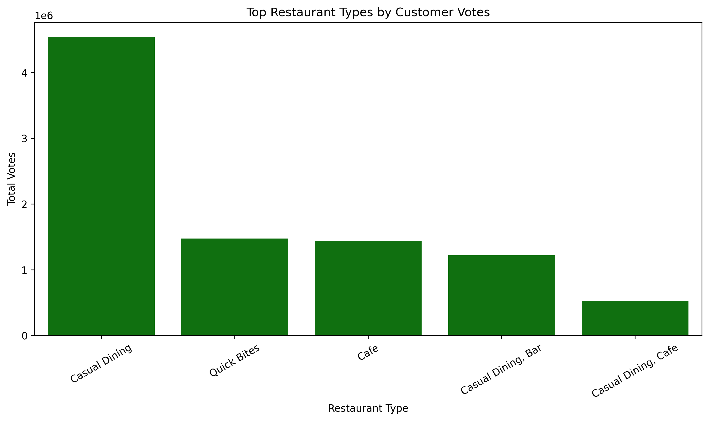
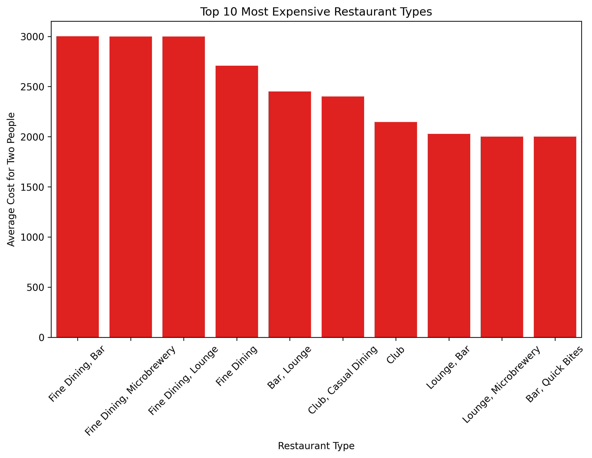
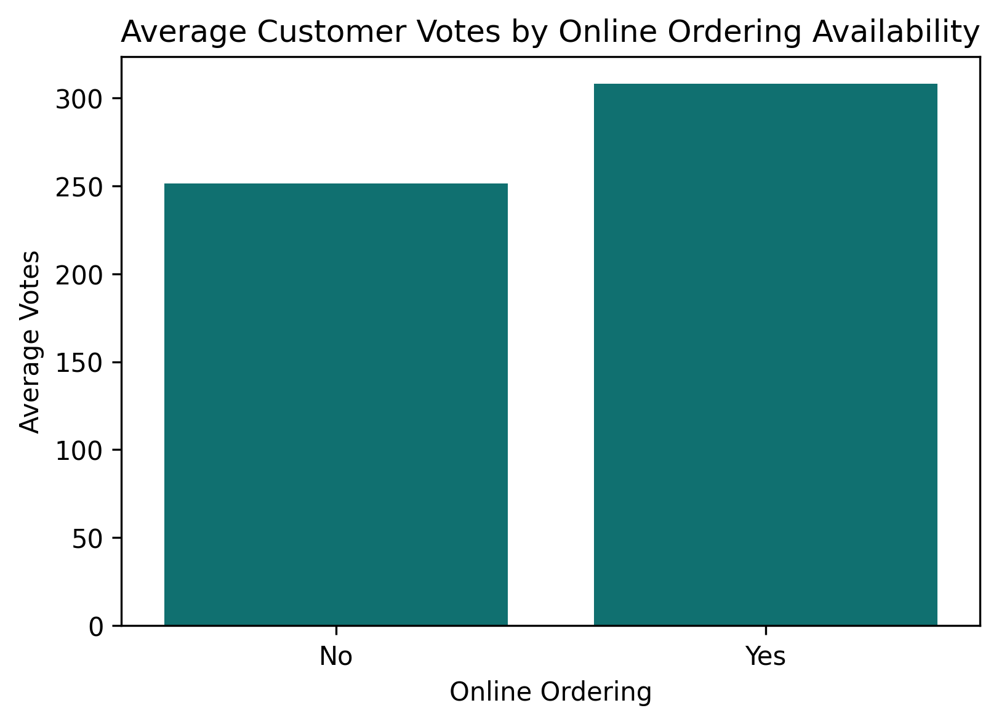
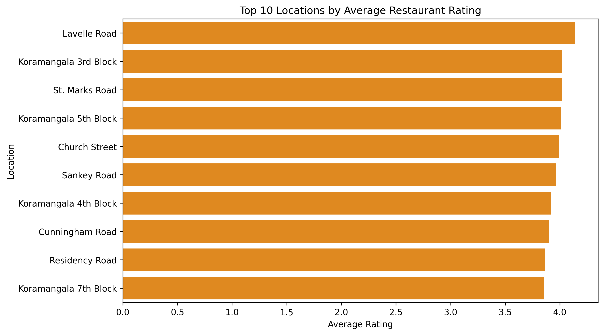

# 🍽️ Zomato Restaurant Analysis Using Pandas

## 📌 Project Overview

This project performs Exploratory Data Analysis (EDA) on the Zomato restaurant dataset using Python and Pandas.

The objective is to uncover customer engagement patterns, restaurant pricing trends, online ordering behavior, and location-based performance through data-driven analysis and visualizations.

---

## 🎯 Business Questions Answered

- Which restaurant types receive the highest customer engagement?
- Do restaurants offering online ordering attract more customer interaction?
- Which restaurant categories are the most expensive?
- Which locations have the highest-rated restaurants?

---

## 🛠️ Tools & Libraries

- Python
- Pandas
- Matplotlib
- Seaborn
---

## 📂 Project Structure

```
zomato-restaurant-analysis
│
├── notebook/
│   └── zomato_analysis.ipynb
│
├── images/
│   ├── top_restaurant_types_by_votes.png
│   ├── top_10_most_expensive_restaurant_types.png
│   ├── online_ordering_vs_customer_votes.png
│   └── top_rated_locations.png
│
├── .gitignore
└── README.md
```

---

## 📊 Visualizations

### Top Restaurant Types by Customer Votes



---

### Top 10 Most Expensive Restaurant Types



---

### Online Ordering vs Customer Engagement



---

### Top Rated Restaurant Locations



---

## 🔍 Key Insights

### Customer Engagement

- Casual Dining restaurants received the highest customer engagement.
- Quick Bites and Cafes also attracted significant customer interaction.

### Online Ordering

- Restaurants offering online ordering received higher average customer votes.
- This suggests greater visibility and customer reach.

### Pricing Analysis

- Fine Dining categories showed the highest average cost for two people.
- Premium dining formats target higher-spending customer segments.

### Location Analysis

- Lavelle Road recorded the highest average restaurant rating.
- Koramangala and St. Marks Road also ranked among the top-performing locations.

---

## 📈 Conclusion

The analysis highlights strong customer preference toward Casual Dining restaurants, while premium restaurant categories dominate pricing segments.

Online ordering appears to positively influence customer engagement, and specific locations consistently achieve higher ratings, making them attractive markets for restaurant businesses.

---

## 👨‍💻 Author

**Sumit Chauhan**

Aspiring Data Analyst | SQL | Python | Pandas | Power BI

GitHub:
https://github.com/Sumit2-pixel
